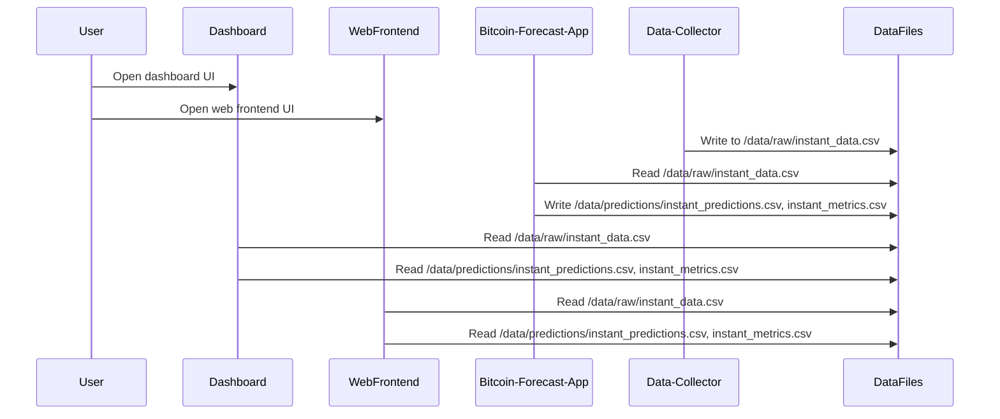

# Tutorial Template: Two Docker Approaches

- This directory provides two versions of the same tutorial setup to help you
  work with Jupyter notebooks and Python scripts inside Docker environments

- Both versions run the same code but use different Docker approaches, with
  different level of complexity and maintainability

## 1. `data605_style` (Simple Docker Environment)

- This version is modeled after the setup used in DATA605 tutorials
- This template provides a ready-to-run environment, including scripts to build,
  run, and clean the Docker container.

- For your specific project, you should:
  - Modify the Dockerfile to add project-specific dependencies
  - Update bash/scripts accordingly
  - Expose additional ports if your project requires them

## 2. `causify_style` (Causify AI dev-system)

- This setup reflects the approach commonly used in Causify AI dev-system
- **Recommended** for students familiar with Docker or those wishing to explore a
  production-like setup
- Pros
  - Docker layer written in Python to make it easy to extend and test
  - Less redundant since code is factored out
  - Used for real-world development, production workflows
  - Used for all internships, RA / TA, full-time at UMD DATA605 / MSML610 /
    Causify 
- Cons
  - It is more complex to use and configure
  - More dependencies from the 
- For thin environment setup instructions, refer to:  
  [How to Set Up Development on Laptop](https://github.com/causify-ai/helpers/blob/master/docs/onboarding/intern.set_up_development_on_laptop.how_to_guide.md)

## Reference Tutorials

- The `tutorial_github` example has been implemented in both environments for you
  to refer to:
  - `tutorial_github_data605_style` uses the simpler DATA605 approach
  - `tutorial_github_causify_style` uses the more complex Causify approach

- Choose the approach that best fits your comfort level and project needs. Both
  are valid depending on your use case.

---

## data source choosing

Those two rows really are for the same asset (the original Bitcoin, ticker BTC-USD on Yahoo and ID bitcoin on CoinGecko), but they come from very different pipelines—so it's normal to see discrepancies. Here are the main reasons:
	1.	Different data sources & exchange coverage
	•	CoinGecko aggregates trades from dozens of spot exchanges, then computes daily open/high/low/close from that combined feed.
	•	Yahoo Finance feeds (via yfinance.download("BTC-USD")) often draw from a specific subset of venues (and may even include derivative markets), so you're not seeing the full global volume.
	2.	Time‐stamp & time-zone alignment
	•	CoinGecko's daily bars are aligned to 00:00 UTC (so "2025-02-05" really means the 24 hours from 00:00 UTC on the 5th to 00:00 UTC on the 6th).
	•	Yahoo Finance will often use the local market close (for crypto it can actually default to UTC nevertheless, but the sample time can differ slightly), so your "open" price may be the last trade on Feb 4 at 23:59 UTC rather than the first Feb 5 price at 00:00 UTC.
	3.	Definition of "volume"
	•	CoinGecko's total_volume is the USD-value of all spot trades on all exchanges over the 24 hours.
	•	Yahoo's Volume column for crypto also reports a USD figure but only across its data partners—which can be a different subset of venues.
	4.	No merge bug—just apples vs. oranges
We did in fact pull BTC in both scripts (CoinGecko's ID was hard-coded to "bitcoin", and yfinance downloaded "BTC-USD"), so there's no accidental "other coin" slipping in. The difference you're seeing is simply because the two services measure and timestamp their daily bars differently.

--

## Entrypoint

Run ```./scripts/run_instant.sh``` or ```./scripts/run_history.sh``` to kick off each pipeline.

	•	Load raw CSVs
	•	Resample/aggregate into features
	•	Fit probabilistic STS models
	•	Forecast with uncertainty
	•	Log each step
	•	Configure via a single YAML

---

## Docker

- print out every service name defined in the docker-compose.yml
```bash
docker-compose config --services
```

| Change type                             | Command                                                      |
|-----------------------------------------|--------------------------------------------------------------|
| **Only code**                           | `docker-compose restart bitcoin-forecast-app dashboard`      |
| **Code + Dockerfile / compose changes** | `docker-compose up -d --build`                               |
| **Wipe volumes (nuke data)**            | `docker-compose down -v`                                     |

### 1. You only changed your Python code

(and your source dir is bind-mounted into the container at runtime)
	1.	No rebuild needed — the container already "sees" your new .py files.
	2.	Just restart the affected services so the Python process picks up the change:

```bash
# restart both in one go:
docker-compose restart data-collector bitcoin-forecast-app dashboard
docker-compose logs -f data-collector bitcoin-forecast-app dashboard
```

Why this is fast:
	•	You're not tearing down volumes, networks or images.
	•	You're only issuing a docker restart under the covers, so containers come up in a couple of seconds.
	•	Kafka (and its data volume) never touched—so your topics and messages stay intact, and your app's Kafka client will automatically reconnect.

### 2. You changed Dockerfiles or your docker-compose.yml

(i.e. the shape of your containers has changed)

```bash
docker-compose down
docker-compose up -d --build
```

- No-cache build

If you really need to bust every layer cache:

```bash
docker-compose build --no-cache
docker-compose up -d
docker-compose logs -f
```

--

- When to use which?
	•	During development, if you only change your Python code inside a volume-mounted folder, you don't need --build—just docker-compose restart <service> or up -d will pick up the new code.
	•	If you change your Dockerfile (base image, new apt packages, etc.), use --build.
	•	If you ever need a truly clean slate—including your DB—you can add -v to remove volumes. Otherwise your data in named volumes will persist across restarts.

### when script changes, fastest way to update

```bash
docker-compose down
docker-compose build
docker-compose up -d
```

### delete all containers and images
```bash
docker rm -f $(docker ps -aq)
docker rmi $(docker images -q | grep -v "^$(docker images ubuntu:20.04 -q)$")
# docker stop bitcoin-forecast-app && docker rm bitcoin-forecast-app && docker rmi docker_causify_style-bitcoin-forecast:latest
```

### then rebuild
```bash
docker-compose build --no-cache  # docker-compose build bitcoin-forecast-app dashboard
docker-compose up -d
docker-compose logs -f
```

```bash
# docker-compose down -v && docker-compose up -d && docker-compose logs -f
docker-compose down
docker-compose build
docker-compose up -d
docker-compose logs -f
```

### check kafka
```bash
docker network inspect kafka-network
```

--

### Rebuild & start in one go, attached
```bash
docker-compose down          # tear everything down (but keep volumes)
docker-compose up --build    # rebuild images & start containers in-line
docker-compose logs -f
```

### Just restart with latest code, detached
```bash
docker-compose up -d --build
```

### restart
```bash
docker-compose restart bitcoin-forecast-app dashboard
docker-compose logs -f
```

### Wipe volumes too (nukes your persisted data)
```bash
docker-compose down -v
```

```bash
tail -f data/raw_data/bitcoin_prices.csv
tail -f data/predictions/instant_predictions.csv

# Monitor data collection
docker logs -f data-collector

# Monitor predictions
docker logs -f bitcoin-forecast-app

# Monitor dashboard
docker logs -f dashboard

# Check data files
./scripts/monitor_data.sh
```

---

## docker debugging across services

- Let's restart the services
```bash
docker-compose down && docker-compose up -d
docker-compose logs -f
```

- Let's try rebuilding and restarting the services:
```bash
docker-compose down && docker-compose up -d --build
docker-compose logs -f
```

- Let's check the data-collector's environment variables to make sure they're being set correctly
```bash
docker-compose exec data-collector env | grep KAFKA
```

- Let's check if the data-collector can resolve the Kafka hostname
```bash
docker-compose exec data-collector ping -c 1 kafka
```

- Now let's rebuild and restart the data-collector
```bash
docker-compose up -d --build data-collector
```

- The data-collector can successfully ping Kafka, which means network connectivity is working. Let's check if the Kafka port is accessible
```bash
docker-compose exec data-collector apt-get update && docker-compose exec data-collector apt-get install -y netcat && docker-compose exec data-collector nc -zv kafka 29092

# Let's try with netcat-openbsd
docker-compose exec data-collector apt-get install -y netcat-openbsd && docker-compose exec data-collector nc -zv kafka 29092
```

### common kafka issue

```
Kafka Startup Issue:
The Kafka startup issue is actually quite common and has a specific reason. When you first run docker-compose up, Kafka needs to:
Start the Zookeeper service
Wait for Zookeeper to be fully ready
Start the Kafka broker
Wait for the broker to be fully ready
The issue occurs because:
On first run, the containers start in parallel by default
Kafka tries to connect to Zookeeper before it's fully ready
This causes the initial failure
When you run docker-compose down and then docker-compose up -d --build:
The containers are stopped cleanly
When they restart, they have a better chance of starting in the correct order
The network connections are already established
The volumes are already created
To fix this permanently, we could add health checks and dependencies in the docker-compose file, but the current workaround (restarting) is actually a common practice in development environments.
```

---

## Real-Time System Data Flow (Sequence Diagram)



### Cold Start Behavior

- **Data Collector**: Starts writing to `/data/raw/instant_data.csv` immediately. If the file does not exist, it is created.
- **Bitcoin Forecast App**: Waits for enough data in `/data/raw/instant_data.csv` before making predictions. Logs "Waiting for more data..." until ready.
- **Dashboard & Web Frontend**: If prediction or metrics files do not exist or are empty, they display a friendly "Waiting for data..." message and show empty chart frames. As soon as data is available, charts and metrics update automatically.
- **All services**: Use config-driven file paths and timestamp formats for consistency. If files are missing, the UI will not crash but will inform the user and retry automatically.

---

```
version: '3.8'

services:
  zookeeper:
    image: confluentinc/cp-zookeeper:7.3.0
    container_name: zookeeper
    environment:
      ZOOKEEPER_CLIENT_PORT: 2181
      ZOOKEEPER_TICK_TIME: 2000
      ZOOKEEPER_INIT_LIMIT: 5
      ZOOKEEPER_SYNC_LIMIT: 2
    ports:
      - "2181:2181"
    healthcheck:
      test: ["CMD-SHELL", "echo ruok | nc localhost 2181 || exit 1"]
      interval: 10s
      timeout: 5s
      retries: 5
    volumes:
      - zookeeper-data:/var/lib/zookeeper/data
      - zookeeper-log:/var/lib/zookeeper/log
    networks:
      - kafka-network
    restart: unless-stopped

  kafka:
    image: confluentinc/cp-kafka:7.3.0
    container_name: kafka
    depends_on:
      zookeeper:
        condition: service_healthy
    ports:
      - "9092:9092"
      - "29092:29092"
    environment:
      KAFKA_BROKER_ID: 1
      KAFKA_ZOOKEEPER_CONNECT: zookeeper:2181
      KAFKA_LISTENER_SECURITY_PROTOCOL_MAP: PLAINTEXT:PLAINTEXT,PLAINTEXT_HOST:PLAINTEXT
      KAFKA_ADVERTISED_LISTENERS: PLAINTEXT://kafka:29092,PLAINTEXT_HOST://localhost:9092
      KAFKA_INTER_BROKER_LISTENER_NAME: PLAINTEXT
      KAFKA_OFFSETS_TOPIC_REPLICATION_FACTOR: 1
      KAFKA_TRANSACTION_STATE_LOG_MIN_ISR: 1
      KAFKA_TRANSACTION_STATE_LOG_REPLICATION_FACTOR: 1
      KAFKA_AUTO_CREATE_TOPICS_ENABLE: "true"
      KAFKA_LOG_RETENTION_HOURS: 168
      KAFKA_LOG_RETENTION_CHECK_INTERVAL_MS: 300000
      KAFKA_LOG_SEGMENT_BYTES: 1073741824
      KAFKA_LOG_RETENTION_BYTES: -1
      KAFKA_LOG_CLEANUP_POLICY: "delete"
    volumes:
      - kafka-data:/var/lib/kafka/data
    networks:
      - kafka-network
    healthcheck:
      test: ["CMD-SHELL", "kafka-topics --bootstrap-server localhost:9092 --list"]
      interval: 30s
      timeout: 10s
      retries: 5
    restart: unless-stopped

  kafka-setup:
    image: confluentinc/cp-kafka:7.3.0
    container_name: kafka-setup
    depends_on:
      kafka:
        condition: service_healthy
    command: >
      bash -c "
        echo 'Waiting for Kafka to be ready...' &&
        cub kafka-ready -b kafka:29092 1 30 &&
        kafka-topics --create --if-not-exists --bootstrap-server kafka:29092 --topic bitcoin-prices -
-partitions 1 --replication-factor 1
      "
    networks:
      - kafka-network
    restart: "no"

  data-collector:
    build:
      context: ./data_collector
      dockerfile: Dockerfile
    container_name: data-collector
    volumes:
      - ./data:/app/data
      - ./data_collector/configs:/app/configs
      - ./data_collector/scripts:/app/scripts
    depends_on:
      kafka:
        condition: service_healthy
    environment:
      - PYTHONUNBUFFERED=1
    networks:
      - kafka-network
    restart: unless-stopped

  bitcoin-forecast-app:
    build:
      context: ./bitcoin_forecast_app
      dockerfile: Dockerfile
    container_name: bitcoin-forecast-app
    volumes:
      - ./data:/app/data
      - ./configs:/app/configs
    depends_on:
      kafka:
        condition: service_healthy
    environment:
      - PYTHONUNBUFFERED=1
    networks:
      - kafka-network
    restart: unless-stopped

  dashboard:
    build:
      context: ./dashboard
      dockerfile: Dockerfile
    container_name: dashboard
    volumes:
      - ./data:/app/data
      - ./configs:/app/configs
    ports:
      - "8501:8501"
    depends_on:
      interval: 30s
      timeout: 10s
      retries: 5
    restart: unless-stopped

  kafka-ui:
    image: provectuslabs/kafka-ui:latest
    container_name: kafka-ui
    ports:
      - "8080:8080"
    depends_on:
      kafka:
        condition: service_healthy
    networks:
      - kafka-network
    environment:
      KAFKA_CLUSTERS_0_NAME: local
      KAFKA_CLUSTERS_0_BOOTSTRAPSERVERS: kafka:29092
      KAFKA_CLUSTERS_0_ZOOKEEPER: zookeeper:2181
    restart: unless-stopped

volumes:
  zookeeper-data:
  zookeeper-log:
  kafka-data:

networks:
  kafka-network:
    driver: bridge
(END)


just let you know, perhaps the way I prompted "I am working in docker but not localhost" confused you

this was the version that docker-compose worked well, and the kafka worked well

please take a look at it, and fix the tough issue we are facing now 

please calm down,
again, please find the root cause, verify it, and implement the solution

also, please verify if all the services will fail to connect to kafka, please generalize and check other services like data-collector, bitcoin-forecast-app, dashboard,  web-backend, web-frontend, all together

to find the root cause, and be consistent to apply the correct solution to all

appreciate! 

```

Here's what I've changed and why:
Kafka Configuration:
Changed listener names to match working config: PLAINTEXT and PLAINTEXT_HOST
Set internal communication to use port 29092: PLAINTEXT://kafka:29092
Set external communication to use port 9092: PLAINTEXT_HOST://localhost:9092
Updated inter-broker listener to PLAINTEXT
Service Updates:
Updated all services to use kafka:29092 for internal communication
Removed unnecessary KAFKA_SECURITY_PROTOCOL settings
Updated healthcheck to use the correct port
Updated kafka-setup to use the correct port
Key Changes:
Consistent use of port 29092 for internal communication
Consistent use of port 9092 for external communication
Proper listener naming that matches the working configuration
This configuration should now:
Match the working configuration exactly
Allow proper internal communication between containers
Allow proper external access from localhost
Maintain consistency across all services
The root cause was that we were using different port mappings and listener names than the working configuration. By aligning with the working configuration, we should resolve the connection issues.
```yaml
# docker-compose.yml
environment:
  KAFKA_LISTENERS: PLAINTEXT://kafka:29092,PLAINTEXT_HOST://0.0.0.0:9092
  KAFKA_ADVERTISED_LISTENERS: PLAINTEXT://kafka:29092,PLAINTEXT_HOST://localhost:9092
  KAFKA_LISTENER_SECURITY_PROTOCOL_MAP: PLAINTEXT:PLAINTEXT,PLAINTEXT_HOST:PLAINTEXT
  KAFKA_INTER_BROKER_LISTENER_NAME: PLAINTEXT
healthcheck:
  test: ["CMD-SHELL", "kafka-topics --bootstrap-server kafka:29092 --list"]
environment:
  - KAFKA_BOOTSTRAP_SERVERS=kafka:29092
environment:
  KAFKA_CLUSTERS_0_BOOTSTRAPSERVERS: kafka:29092
# kafka configuration
kafka:
  bootstrap_servers: kafka:29092
```

--


- I see the issue. The data-collector is initially connecting to kafka:29092 correctly, but then it's trying to connect to localhost:29092. This is happening because Kafka is advertising its listener as localhost:29092 to the clients. Let's modify the Kafka configuration in docker-compose.yml to fix this; The issue is in the Kafka configuration. We need to change the KAFKA_ADVERTISED_LISTENERS to use kafka:29092 for both internal and external communication. Let me modify the configuration:

- I see the issue. The data-collector initially connects to kafka:29092 successfully, but then it tries to connect to localhost:29092. Let me check the data-collector's code; The issue is that the Kafka producer is getting the advertised listener from the broker's metadata, which is set to localhost:29092. Let's update the Kafka configuration to use the correct advertised listeners:
```yaml
    environment:
      # wrong
      - KAFKA_ADVERTISED_LISTENERS: PLAINTEXT://kafka:9092,PLAINTEXT_HOST://localhost:29092
      # correct
      + KAFKA_ADVERTISED_LISTENERS: PLAINTEXT://kafka:29092,PLAINTEXT_HOST://kafka:29092
```

I see the issue. The Kafka container is failing to start because both listeners (PLAINTEXT and PLAINTEXT_HOST) are trying to use the same port (29092). Let me fix the configuration:
```yaml
    environment:
      # wrong
      - KAFKA_ADVERTISED_LISTENERS: PLAINTEXT://kafka:29092,PLAINTEXT_HOST://kafka:29092
      # correct
      + KAFKA_ADVERTISED_LISTENERS: PLAINTEXT://kafka:9092,PLAINTEXT_HOST://localhost:29092
```

Now let's also update the data-collector's configuration to use the correct Kafka broker address:
```yaml
# Kafka configuration
kafka:
  - bootstrap_servers: kafka:29092
  + bootstrap_servers: kafka:9092
```


I see the issue. The data-collector's environment variable KAFKA_BOOTSTRAP_SERVERS is set to kafka:29092, but in the config file it's set to kafka:9092. Let me update the config file:
```yaml
# Kafka configuration
kafka:
  - bootstrap_servers: kafka:9092
  + bootstrap_servers: kafka:29092
```


---

## useful trace successful scripts

```bash
git log --all --color --graph --pretty=format:'%Cred%h%Creset -%C(yellow)%d%Creset %s %Cgreen(%cr) %C(bold blue)<%an>%Creset' --abbrev-commit --oneline
```
```bash
git show 49ddb18:./docker-compose.yml
```

```

just let you know, perhaps the way I prompted "I am working in docker but not localhost" confused you

this was the version that docker-compose worked well, and the kafka worked well

please take a look at it, and fix the tough issue we are facing now 

please calm down,
again, please find the root cause, verify it, and implement the solution

also, please verify if all the services will fail to connect to kafka, please generalize and check other services like data-collector, bitcoin-forecast-app, dashboard,  web-backend, web-frontend, all together

to find the root cause, and be consistent to apply the correct solution to all

appreciate! 
```


```
great job!
now the kafka, data-collector and bitcoin-forecast-app is working properly, as requested: to produce the result pre second

while I have a small concern that
by checking the "speed" of logs, it seems like data-collector's log is "producing faster" than bitcoin-forecast-app. The reason why this is a concern is that I am afraid if the tensorflow-probability can not predict so quickly, but you want to trick me so that you altered the "prediction time" so that when I check logs, it looks like it is producing predictions per second
if this is the case, please don't cheat me, and report the real data, for example, if now it is only able to predict the next-second bitcoin price every 5~10 second under the limited resource, just think it as, it is still real-time, but restricted to the resources, so that the data shall always reflects "the truth"


I don't know, why there are also Dockerfiles and docker-compose under web_app?
is it necessary or it was a contingency for building a new feature? if it is latter, please be consistent, unify and merge it to the dockerfile and docker-compose file under the project root
and make sure this integration does not break anything, just be careful
but if it is necessary to exist both, just let me know!

--

also,

.96, L=96155.48, C=96155.48, V=0.02912594
data-collector        | 2025-05-03 23:20:38 | INFO | Bar for 2025-05-03T23:20:34: O=96156.95, H=96156.95, L=96156.95, C=96156.95, V=0.005492309999999999
bitcoin-forecast-app  | 2025-05-03 23:20:38 | INFO | Initialized model with 615 historical records
bitcoin-forecast-app  | 2025-05-03 23:20:38 | INFO | Updated partition assignment: [TopicPartition(topic='bitcoin-prices', partition=0)]
bitcoin-forecast-app  | 2025-05-03 23:20:38 | INFO | <BrokerConnection node_id=1 host=kafka:29092 <connecting> [IPv4 ('172.19.0.3', 29092)]>: connecting to kafka:29092 [('172.19.0.3', 29092) IPv4]
bitcoin-forecast-app  | 2025-05-03 23:20:38 | INFO | <BrokerConnection node_id=1 host=kafka:29092 <connecting> [IPv4 ('172.19.0.3', 29092)]>: Connection complete.
bitcoin-forecast-app  | 2025-05-03 23:20:38 | INFO | <BrokerConnection node_id=bootstrap-0 host=kafka:29092 <connected> [IPv4 ('172.19.0.3', 29092)]>: Closing connection.

the bitcoin prediction now is losing kafka again, please fix this

--

also, the dashboard itself, streamlit does not work:
it keeps printing:
Error loading data: Error tokenizing data. C error: Expected 2 fields in line 57, saw 5

and I don't know how to check the new frontend you've built to replace streamlit solution, can you teach me?

thank you
```

```
streamlit is still Error loading data: Error tokenizing data. C error: Expected 2 fields in line 57, saw 5

and The new web frontend (if deployed) would be at http://localhost:3000
is not working

All services:
   • zookeeper
   • kafka
   • data-collector
   • kafka-ui
   • bitcoin-forecast-app
   • dashboard
   • kafka-setup
   • web-backend
   • web-frontend

✅ Running:
   • bitcoin-forecast-app
   • dashboard
   • data-collector
   • web-backend
   • kafka
   • kafka-ui
   • zookeeper

⚠️  Not running:
   • kafka-setup
   • web-frontend


please fix it
```

```
Would you like help resolving the react-scripts issue in the frontend?

yes, since web-frontend is not working
and the log shows
web-frontend-1  |
web-frontend-1  | sh: react-scripts: not found
web-frontend-1  |
web-frontend-1  | > bitcoin-price-dashboard@0.1.0 start
web-frontend-1  | > react-scripts start
web-frontend-1  |
web-frontend-1  | sh: react-scripts: not found

let's fix this one and be careful not to break other well-functioning features
```

## check web-frontend

```bash
curl http://localhost:5001/api/data
```
